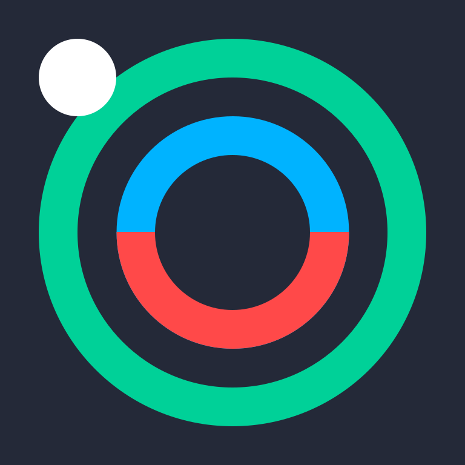

<picture>
  <source media="(prefers-color-scheme: dark)" srcset="NexuAura2-logo.svg">
  
</picture>

# NexuAura 1.0 / Pnlo / NexuAura-Script 1.0 

NexuAura是一种新的解释器，提前尝试改进语法，NexuAura主题，UI框架

UI设计工具 → UI设计文件(Pnlo) → NexuAura-UI解释器 → 程序 → 渲染UI

NexuAura-Script (程序编程事件) 未出现

NexuAura-UI是一种军舰鸟的UI框架，UI设计界面文件尝试改进

高性能解析器 / mvvm模式

配置文件格式: Pnlo、yaml、json、TOML、
你们要投票要哪个配置文件格式?
已经投票了配置文件格式用是Pnlo

支持 NanoGUI，LVGL，Tauri

| 系统 | 界面库 | 支持 | 
|:--:|:--:|:--:|
| Wnodws | NanoGUI | ✅ |
| Wnodws | Tauri | ✅ |
| Wnodws | ImGUI | ✅ |
| | maui | ✅ |
| | avaui | ✅ |

